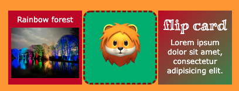

**Flip cards** help people interact with a webpage. They also allow you to provide additional information in a small space or hide information that shouldn't be immediately visible. Some common examples of animated flip cards are revision cards, business cards, social media contact cards, and product cards. 

A flip card has four main parts:
+ The card itself
  + The flip control
    + The front card face
    + The back card face

Add this code to `index.html` to position your card on the webpage: 

--- code ---
---
language: html
filename: index.html
line_numbers: false

---
    
 <!-- The card -->
        
 <!-- To control the flip -->
            
 <!-- The front card face -->
            <!-- Add your front card content here including images, text etc -->
            

          
            
 <!-- The back card face -->
            <!-- Add your back card content here including images, text etc -->
            

        

    

--- /code ---

The flip card uses four CSS classes:
+ `card`: sets the size of the card 
+ `card-content`: controls the flip timing, perspective, and effect 
+ `card-face`: hides the face when it is flipped to the back
+ `flipme`: flips the second card face 180 degrees on the y-axis so it is flipped in the opposite direction to the front card face

The `card-content` class rotates 180 degrees on the y-axis when hovered over, which means the two card faces switch position.

## Customise the card faces

You can add text (including emojis), images, quotes, or lists to your card faces. 

You can apply one or more style classes, such as:
+ `rounded`
+ `xcenter` , `ycenter`
+ `gradient1` , `gradient2`
+ `dashed-border`, `solid-border`
+ `primary` , `secondary` , `tertiary`

An example on how to do this is shown below:

--- code ---
---
language: html
filename: index.html
line_numbers: false

---
     

            

              

                
              

              

                <h2>Lapis Sarawak</h2>
                
A cake baked in layers to make colourful patterns.

              

            

        

--- /code ---

<iframe src="https://staging-editor.raspberrypi.org/en/embed/viewer/web-flip-cards-example" width="600" height="500" frameborder="0" marginwidth="0" marginheight="0" allowfullscreen> </iframe>

--- print-only ---

--- /print-only ---
